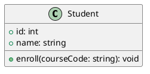
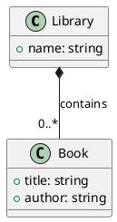
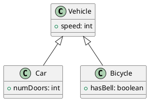
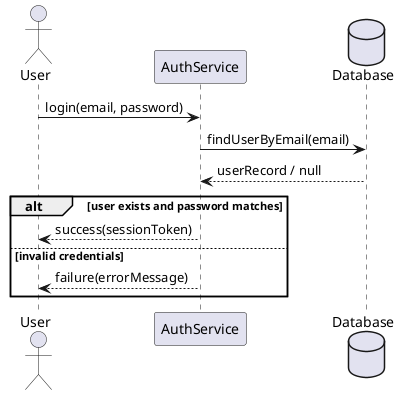
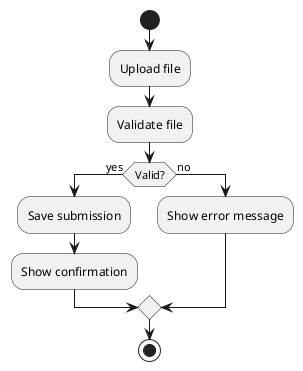

# Example UML Questions (Simple)

Below are 5 simple UML questions suitable for students, with answers provided as PlantUML.

---

## 1) Class diagram: Student

**Question:** Draw a UML class diagram for a `Student` with `id: int`, `name: string`, and a method `enroll(courseCode: string): void`.

**Answer (PlantUML):**

---

## 2) Class diagram: Library contains Books (composition)

**Question:** Draw a UML class diagram showing a `Library` that contains many `Book`s (composition). `Book` has `title: string` and `author: string`.

**Answer (PlantUML):**

---

## 3) Class diagram: Inheritance

**Question:** Draw a UML class diagram with inheritance: `Vehicle` (with `speed: int`) is a parent of `Car` and `Bicycle`.

**Answer (PlantUML):**

---

## 4) Sequence diagram: Login flow

**Question:** Draw a UML sequence diagram for a user logging in: `User` sends `login(email, password)` to `AuthService`, which checks with `Database`, and returns either `success` or `failure` to `User`.

**Answer (PlantUML):**

---

## 5) Activity diagram: Submit assignment

**Question:** Draw a UML activity diagram for submitting an assignment: start → upload file → validate file → if valid, save submission and show confirmation; if invalid, show error → end.

**Answer (PlantUML):**

